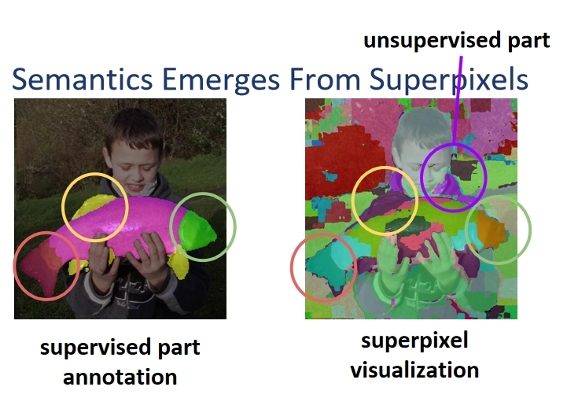
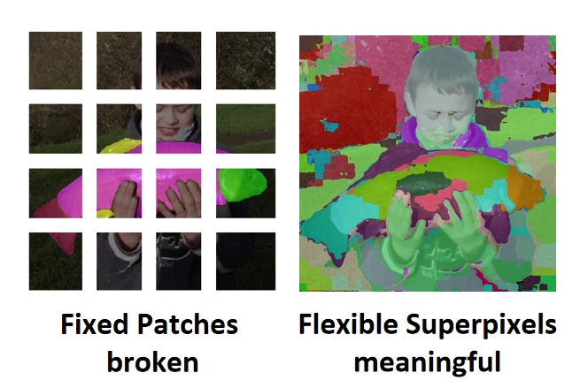
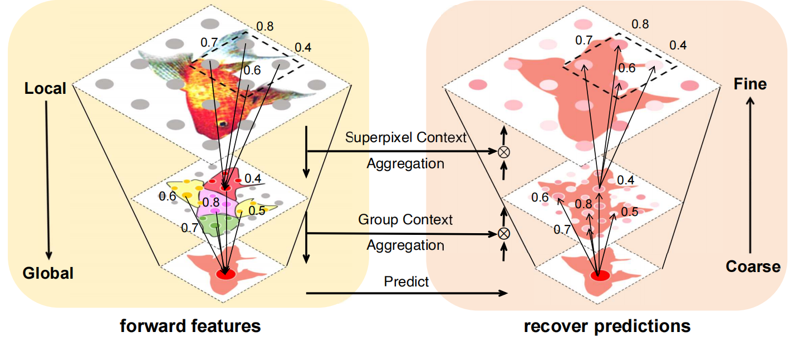
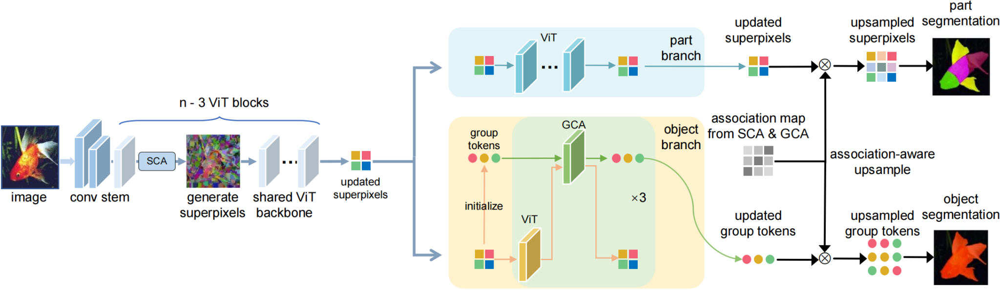
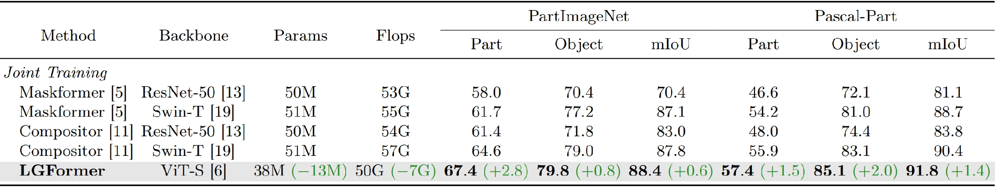
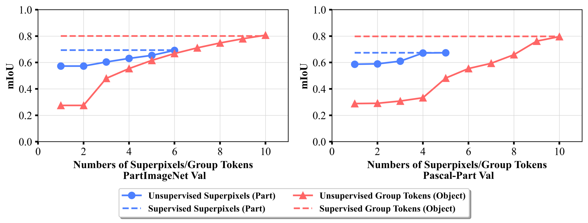

LGFormer is a hierarchical transformer-based model, based on superpixels, designed for sophisticated image segmentation tasks, effectively bridging the granularity of part segmentation with the comprehensive scope of object segmentation. This repository contains the official implementation of LGFormer, which is introduced in the paper:

[**From Pixels to Objects: A Hierarchical Approach for Part and Object Segmentation Using Local and Global Aggregation**](https://arxiv.org/abs/2409.01353),
[*Yunfei Xie*](https://yunfeixie233.github.io/) (Huazhong University of Science and Technology),
[*Cihang Xie*](https://cihangxie.github.io/) (UC Santa Cruz),
[*Alan Yuille*](http://www.cs.jhu.edu/~ayuille/) (Johns Hopkins University),
[*Jieru Mei*](https://meijieru.com/) (Johns Hopkins University),
ECCV 2024.

<div align="center">

</div>

- Part semantics emerge from superpixel visualization, even without supervision.
- Superpixels naturally discover part semantics, making them ideal for capturing fine-grained representations.


## 📢 Breaking News

- **[📄💥 September 2, 2024] [Our arXiv paper is released](https://arxiv.org/abs/2409.01353).**


## Motivation
Fixed patches, as traditionally used in image transformers, often lead to broken and non-semantic representations of objects. In contrast, flexible superpixels offer a more meaningful representation of image parts, enabling finer granularity and better overall understanding. Superpixels naturally discover part semantics without the need for annotations. 

<div align="center">

</div>

- Patch Tokens ≠ Semantic Tokens  
- Superpixels are better part representations.

## Bidirectional Hierarchical Design and Pipeline
LGFormer uses a bidirectional design that aggregates features from local to global contexts in the forward pass and recovers predictions from coarse to fine in the backward pass. This hierarchical representation moves from pixels to superpixels to groups, efficiently balancing fine-grained segmentation with global context understanding. The pipeline follows a dual-branch structure, where one branch focuses on part tokens and the other on group tokens.

<div align="center">

</div>
<div align="center">

</div>

## Supervised Results
LGFormer outperforms previous state-of-the-art models in both part and object segmentation tasks, while requiring significantly less computational resources. This efficiency is achieved through the use of superpixels and hierarchical aggregation.

<div align="center">

</div>

## Unsupervised Results
Quantitive Evaluation of Unsupervised Superpixels and Groups:
Employing 6 superpixels for part segmentation and 10 groups for object segmentation in an unsupervised setting yielded mIoU scores comparable to those achieved with supervised methods.

<div align="center">

</div>

## Installation
To be updated.

## Citation
@misc{xie2024pixelsobjectshierarchicalapproach,  
title={From Pixels to Objects: A Hierarchical Approach for Part and Object Segmentation Using Local and Global Aggregation},  
author={Yunfei Xie and Cihang Xie and Alan Yuille and Jieru Mei},  
year={2024},  
eprint={2409.01353},  
archivePrefix={arXiv},  
primaryClass={cs.CV},  
url={https://arxiv.org/abs/2409.01353},  
}


## 📜 Citation

If you find this work useful for your research and applications, please cite using this BibTeX:

```bibtex
@misc{xie2024pixelsobjectshierarchicalapproach,  
title={From Pixels to Objects: A Hierarchical Approach for Part and Object Segmentation Using Local and Global Aggregation},  
author={Yunfei Xie and Cihang Xie and Alan Yuille and Jieru Mei},  
year={2024},  
eprint={2409.01353},  
archivePrefix={arXiv},  
primaryClass={cs.CV},  
url={https://arxiv.org/abs/2409.01353},  
}

```